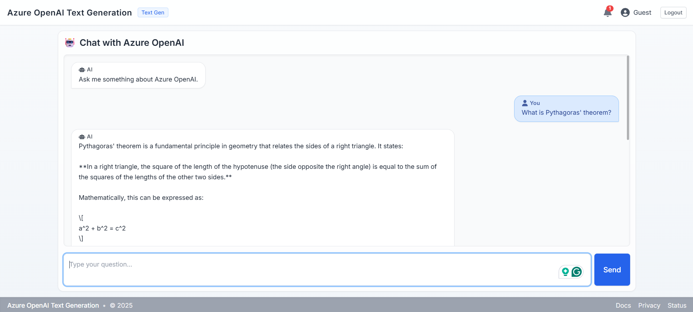

# flask-react-aoai-completions

ChatGPT Clone – Python Flask + React (Vite + TypeScript) using Azure OpenAI Chat Completions.

## 🔍 Overview

This project provides:

- A Flask backend exposing `/api/` and `/api/completions` (single‑turn chat) calling Azure OpenAI.
- A React + TypeScript frontend with a simple multi‑message chat UI.
- Basic logging (text or JSON) and unit tests (pytest & Vitest + Testing Library).

## 🗂 Project Structure

```text
src/
 backendpy/
  app.py
  api/
  services/
  utils/
  requirements.txt
 frontend/
  package.json
  src/
   components/
   services/
   __tests__/  (Vitest tests)
tests/            (Python pytest tests)
```

## ⚙️ Environment Variables (Backend `.env`)

```env
AZURE_OPENAI_ENDPOINT=https://<your-resource>.openai.azure.com
AZURE_OPENAI_API_KEY=<your-key>
AZURE_OPENAI_API_KEY_V1=<your-key>        # (optional duplicate for compatibility)
AZURE_OPENAI_DEPLOYMENT_NAME=<your-deployment-name>
AZURE_OPENAI_API_VERSION=2024-05-01-preview
# Optional logging controls
LOG_LEVEL=INFO
LOG_FORMAT=json          # or 'text'
```

> Ensure the deployment name matches the name shown under “Deployments” in the Azure OpenAI portal (NOT just the model name).

## 🐍 Backend Setup & Run

```powershell
cd src/backendpy
python -m venv .venv
. .venv/Scripts/Activate.ps1
pip install -r requirements.txt
python app.py   # starts on http://127.0.0.1:5009
```

## 🐍 Running Backend Tests (pytest)

Tests live in `tests/` and mock Azure OpenAI (no real API calls).

```powershell
cd <repo-root>
. .\src\backendpy\.venv\Scripts\Activate.ps1
pytest -q
```

Sample output:

```text
....  [100%]
4 passed in 0.30s
```

## ⚛️ Frontend Setup & Run

```powershell
cd src/frontend
npm install
npm run dev   # http://localhost:5173
```

Configure a proxy or set `VITE_API_BASE_URL` (create `src/frontend/.env`):

```env
VITE_API_BASE_URL=http://127.0.0.1:5009/api
```

## ⚛️ Running Frontend Tests (Vitest + Testing Library)

```powershell
cd src/frontend
npm run test        # headless
npm run test:ui     # interactive (watch/UI if supported)
```

Sample output:

```text
✓ Chat component (2)
 ✓ renders initial assistant message
 ✓ sends a prompt and displays response

Test Files  1 passed (1)
Tests       2 passed (2)
```

## 🗒 API Endpoint

`POST /api/completions`

```jsonc
Request: { "prompt": "Explain Azure OpenAI" }
Response: {
 "response": "Azure OpenAI provides...",
 "usage": { "prompt_chars": 23, "response_chars": 42 }
}
```

Errors return:

```json
{ "error": "Prompt too long. Max 4000 characters." }
```

## 🧪 Test Philosophy

Backend: minimal fast tests (route availability, validation, success) with a dummy client to avoid network calls.
Frontend: UI rendering & interaction for Chat component; mock API layer.

## 🪵 Logging

Configure via `LOG_LEVEL` & `LOG_FORMAT`.

- Text example: `2025-08-16 18:20:11 | INFO | Starting Chat Completions API`
- JSON example: `{ "ts": "2025-08-16T18:20:11Z", "level": "INFO", "msg": "Starting Chat Completions API" }`

## 🛠 Troubleshooting 401 Errors (Azure OpenAI)

1. Endpoint form: `https://<resource>.openai.azure.com` (no extra path).
2. Deployment name must match portal deployment.
3. Key must be active (try regenerating Key 1, update `.env`, restart backend).
4. API version supported by your model.
5. Remove stray quotes or spaces around keys.

## 🚀 Next Ideas

- SSE streaming
- Multi‑turn with conversation trimming
- Rate limiting & auth
- Docker / CI pipeline

## UI First Look



## Prompts to text in the live session

### Use case 1

```text
One-Hot Encoding is a technique used in machine learning and data preprocessing to convert categorical variables into a numerical format that algorithms can understand. Since many models cannot directly process text or categorical labels, one-hot encoding represents each category as a binary vector. For example, if you have three categories—Red, Green, and Blue—they would be represented as [1,0,0], [0,1,0], and [0,0,1] respectively. This ensures that no ordinal relationship is implied between categories, which is important because Red is not inherently greater or smaller than Blue or Green.

However, while One-Hot Encoding is simple and effective, it can lead to what is known as the “curse of dimensionality” when dealing with features that have a large number of categories. Each unique category requires its own column in the encoded dataset, which significantly increases memory usage and computational cost. For this reason, alternatives like label encoding, frequency encoding, or embedding techniques are sometimes preferred for high-cardinality features. Still, one-hot encoding remains one of the most widely used and reliable methods for handling categorical variables, especially when the number of categories is manageable.

Please summarize
```

### Use case 2

```text
This book on AI was absolutely fantastic! The explanations were clear, the examples were practical, and I walked away with a strong understanding of both the fundamentals and real-world applications. A must-read for anyone serious about AI.

Sentiment?


I was very disappointed with this AI book. The writing was confusing, the code samples didn’t work, and the content felt outdated. Honestly, it was a waste of money and time.

Sentiment?

The book provided a decent overview of AI concepts. It wasn’t too detailed, but it gave a general sense of the subject. If you’re looking for depth, you may need to consult other resources, but as an introduction, it’s okay.

Sentiment?
```

### Use case 3

```text
Tell me a story about the Sun, the Moon, the Stars, and other planets in Telugu. Translate that into Hindi and English
```

### Use case 4

```text
Way to go

What is the meaning of the above?
```

### Use case 5

```text  
What is Pythagoras' theorem?
```
