# Flask Azure OpenAI API (Backend Deep Dive)

Python Flask backend powering Azure OpenAI Chat Completions for the demo React UI.

## 🔸 High-Level Feature Summary

- Factory-based app creation (`create_app()` in `app.py`).
- Blueprints: `home_routes` (welcome / root) and `completions_routes` (POST `/api/completions`).
- Robust error handling: unified JSON responses for 4xx/5xx + correlation IDs.
- Structured logging (text or JSON) with latency & request correlation.
- Environment loading with upward `.env` discovery + OS env precedence.
- Config diagnostics endpoint: `GET /api/config/info` (non‑secret config & source visibility).
- Azure OpenAI service wrapper with cached client + safe exception wrapping.
- Prompt validation (required + max 4000 chars).
- Fully isolated tests (no `pytest-flask`, Azure mocked) – 6 tests covering success, validation & error handlers.

---

## 🧠 Architecture (High-Level)

```mermaid
%%{init: {
  'flowchart': { 'useMaxWidth': true, 'htmlLabels': true, 'nodeSpacing': 60, 'rankSpacing': 90 },
  'themeVariables': { 'fontSize': '16px', 'fontFamily': 'Segoe UI, Roboto, Helvetica, Arial' }
}}%%
flowchart TB

  %% Row 1 — Frontend
  subgraph Row1["Frontend"]
    direction LR
    Browser["User Browser"]
    UI["Chat.tsx + components"]
    APIClient["services/api.ts (Vite proxy /api)"]
    Browser --> UI --> APIClient
  end

  %% Row 2 — Backend
  subgraph Row2["Backend"]
    direction LR
    Gateway["/api/*"]
    Routes["Blueprints: home_routes, completions_routes, config_routes"]
    Service["services/azure_openai_service.py"]
    Utils["utils: env_config, logging_config"]

    APIClient -- "fetch JSON" --> Gateway
    Gateway --> Routes --> Service
    Utils -. "config & logging" .- Gateway
    Utils -. "config & logging" .- Routes

    ConfigInfo["GET /api/config/info"]:::diag
    Gateway -. diagnostics .- ConfigInfo
  end

  classDef diag fill:#efeaff,stroke:#a48cf2,color:#3b2d72;

  %% Row 3 — External
  subgraph Row3["External"]
    direction LR
    Azure["Azure OpenAI Deployment"]
  end

  Service --> Azure
```



Highlights:

- Vite proxy for /api avoids CORS in dev; or enable Flask-CORS.
- /api/config/info surfaces non-secret config with source for quick checks.
- Blueprints cleanly separate concerns; Azure calls isolated in a service.

---

## 🔹 Installation & Setup

> 1. Change directory to: `D:\STSAAIMLDT\flask-react-aoai-completions\src\backend`

```powershell
python --version
pip --version

pip install virtualenv
python -m venv .venv
.\.venv\Scripts\Activate.ps1   # PowerShell activation
python -m pip install --upgrade pip

pip install -r requirements.txt  # Preferred (already committed)

# OR initial manual install (when bootstrapping):
# pip install Flask python-dotenv openai flask-cors
# pip freeze > requirements.txt
```

> Use the committed `requirements.txt` for reproducible environments. A `.python-version` in repo root may guide tooling (e.g. pyenv) – ensure you're on a compatible 3.12/3.13 interpreter.

---

## 🔹 Environment & Configuration Resolution

Configuration values are resolved with the following precedence per key:

1. Exported OS environment variable (e.g. set in your shell, CI, or process environment)
2. Value from the first `.env` file found while walking upward from `utils/env_config.py` to the repository root
3. Absent (reported as `null` in health output)

Visible (non secret) keys surfaced via `/api/config/info`:

- `AZURE_OPENAI_ENDPOINT`
- `AZURE_OPENAI_DEPLOYMENT_NAME`
- `AZURE_OPENAI_API_VERSION`
- `LOG_LEVEL`
- `LOG_FORMAT`

Secrets (`AZURE_OPENAI_API_KEY`, `AZURE_OPENAI_API_KEY_V1`) are intentionally masked unless explicitly inspected in your own environment – they are never returned from any endpoint.

> Tip: If a value differs from what you expect in `.env`, check whether an OS‑level variable is overriding it.

### Example `.env`

```env
AZURE_OPENAI_ENDPOINT=https://<resource>.openai.azure.com
AZURE_OPENAI_API_KEY=<key>
AZURE_OPENAI_API_KEY_V1=<key>   # Optional duplicate
AZURE_OPENAI_DEPLOYMENT_NAME=<deployment>
AZURE_OPENAI_API_VERSION=2024-05-01-preview
LOG_LEVEL=INFO
LOG_FORMAT=json
```

---

## 🔹 Logging & Observability

Configured in `utils/logging_config.py`:

- Middleware assigns a `correlation_id` (header `X-Request-ID` if supplied, else UUID) and measures latency per request.
- After each request, a structured log entry is written to `./logs/app.log`.
- JSON log format example:

```json
{ "ts": "2025-08-17T08:21:55.123Z", "level": "INFO", "msg": "GET /api/ 200", "correlation_id": "...", "path": "/api/", "method": "GET", "latency_ms": 12.4 }
```

- Toggle structure with `LOG_FORMAT` (`json` or `text`).
- Startup log redacts secrets and prints effective config (source aware) for fast diagnostics.

---

## 🔹 Error Handling Model

Custom handlers ensure consistent JSON shape:

| Scenario | Status | Body Schema |
|----------|--------|-------------|
| 404 | 404 | `{ "error": "Resource not found", "correlation_id"? }` |
| Known HTTPException | e.g. 400 | `{ "error": <description>, "correlation_id"? }` |
| Unhandled exception | 500 | `{ "error": "Internal server error", "correlation_id"? }` |
| Misconfiguration (`RuntimeError` containing `configuration incomplete`) | 500 | `{ "error": "Azure OpenAI configuration incomplete..." }` |

The correlation ID (if present) is echoed in the response header `X-Request-ID` and JSON body.

---

## 🔹 Health & Diagnostics Endpoint

`GET /api/config/info` returns a JSON document listing each visible config key with:

```json
{
  "AZURE_OPENAI_ENDPOINT": { "value": "https://...", "source": "env" },
  "LOG_FORMAT": { "value": "json", "source": "file" }
}
```

Sources: `env` (exported), `file` (.env), or `absent`.

---

## 🔹 Azure OpenAI Service Wrapper

Located at `services/azure_openai_service.py`:

- `_get_client()` lazily constructs and LRU‑caches the `AzureOpenAI` client (single instance per process).
- Validation raises a `RuntimeError` if required config is missing.
- `fetch_completion_response(prompt)` builds a minimal two‑message chat (system + user) and returns the first completion's content.
- Any exception is returned as a string prefixed with `"Error:"` so the route layer can translate it into a clean JSON error without leaking stack traces.

---

## 🔹 Completions Endpoint Contract

`POST /api/completions`

Request JSON:

```json
{ "prompt": "Explain Azure OpenAI" }
```

Validation Rules:

- `prompt` is required (400 if missing)
- Max length: 4000 characters (400 if exceeded)

Successful Response:

```json
{
  "response": "...model text...",
  "usage": { "prompt_chars": 23, "response_chars": 312 }
}
```

Error Response Example:

```json
{ "error": "'prompt' is required" }
```

---

## 🔹 Testing (Pytest) – No `pytest-flask`

We intentionally do **not** install `pytest-flask` because it imports removed internals (e.g. `_request_ctx_stack`) incompatible with Flask 3.x. Instead we keep explicit, minimal fixtures.

### How it works

`tests/conftest.py` provides:

1. A dummy Azure OpenAI client via an `autouse` fixture (`patch_azure_openai`) so no real network call occurs.
2. An `app` fixture that imports and calls `create_app()` from `app.py`.
3. A `client` fixture that simply returns `app.test_client()` (the standard Flask test client—no plugin wrapper needed).

Minimal snippet (simplified):

```python
@pytest.fixture
def app():
  from app import create_app
  return create_app()

@pytest.fixture
def client(app):
  return app.test_client()
```

### What the tests cover (6 total)

1. Root route (`/` and `/api/`) returns welcome JSON.
2. Completions validation: missing prompt → 400 JSON error.
3. Completions success path with mocked Azure client.
4. 404 handler returns structured JSON.
5. Generic unhandled exception path returns masked 500 error.
6. (Implicit) Usage object presence & shape.

### Why this is enough

- Flask ships with `test_client()` – no plugin wrapper needed.
- Explicit fixtures make test intent transparent.
- No network: deterministic, fast feedback (<1s typical).

Run:

```powershell
cd <repo-root>
. .\src\backend\.venv\Scripts\Activate.ps1
pytest -q
```

---

## 🔹 Running the Backend

### Running the tests

From repo root (ensures `pyproject.toml` pytest config is picked up):

```powershell
cd <repo-root>
. .\src\backend\.venv\Scripts\Activate.ps1
pytest -q
```

### Configuration

`pyproject.toml` includes:

```toml
[tool.pytest.ini_options]
addopts = "-q"
pythonpath = [".", "src/backend"]
```

That `pythonpath` entry lets tests import backend modules without adjusting `PYTHONPATH` manually.

Result: fast, isolated tests (mocked Azure) with **zero** need for `pytest-flask`.

## 🔹 To install dependencies later

```bash
pip install -r requirements.txt
```

## Update the .env file

## Update the environment variable `AZURE_OPENAI_API_KEY`

> 1. After updating verify the `AZURE_OPENAI_API_KEY`. **Only for INTERNAL USE.**

```PowerShell
$env:AZURE_OPENAI_API_KEY
```

## 🔹 Project Structure

```text
flask-react-aoai-completions/
│── docs/
│── src/
│   ├── backend/
│   │   ├── api/ (Routes)
│   │   ├── services/ (Azure OpenAI Integration)
│   │   ├── utils/ (Configs & Logging)
│   │   ├── app.py
│── .gitignore
│── README.md
```

## 🔹 How to Execute

### ✅ Method 1: Run `app.py` Directly

```powershell
python .\app.py
py .\app.py
```

This will start the Flask server, and you should see output like:

```text
Starting Flask Azure OpenAI API Server...
 * Running on http://127.0.0.1:5009/ (Press CTRL+C to quit)
```

Visit:

- Base: <http://127.0.0.1:5009/>
- API root: <http://127.0.0.1:5009/api/>
- Config info: <http://127.0.0.1:5009/api/config/info>

Test a completion (PowerShell):

```powershell
Invoke-RestMethod -Uri "http://127.0.0.1:5009/api/completions" -Method POST -Headers @{"Content-Type"="application/json"} -Body '{"prompt":"Hello"}'
```

---

### ✅ Method 2: Use `flask run` (Requires Setting Environment Variables)

Before running the app, set environment variables:

```powershell
$env:FLASK_APP = "app"
$env:FLASK_ENV = "development"
flask run --host=0.0.0.0 --port=5009
```

This will also start the Flask server.

```powershell
Invoke-RestMethod -Uri "http://127.0.0.1:5009/api/completions" `
                  -Method POST `
                  -Headers @{"Content-Type"="application/json"} `
                  -Body '{"prompt": "What is an Orange"}'

```

---

### Stopping the Server

Press **CTRL + C** in the PowerShell terminal to stop the server.

---

🚀 **Try it out and let me know if you need any help!** 😃

---

## 🔹 Quick API Usage Recap

See Completions Contract above. For dynamic config inspection use `GET /api/config/info`.
